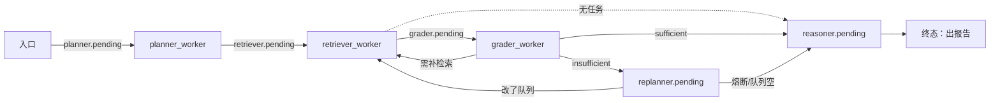

# 契约冻结（M0-T1）

> **这份文件的地位**：从 P0 起，下面每一条都是**接口契约**。
> 任何一条要改，必须同时改：本文件 + 全部实现 + 全部测试。
> 改完不更新本文件 = 契约漂移，视为 bug。

**冻结时间**：P0 阶段。**验证方式**：`tests/test_e2e_graph.py` + `tests/test_graph_vertex_names.py`
（契约不是写在文档里的愿望，是写在测试里的断言）。

---

## 契约 0 · 总原则

| 原则 | 含义 | 违反的后果（本项目已发生过） |
|---|---|---|
| **单一真源** | Prompt 只在 `prompts.py`；配置只在 `config.yaml`；图引擎只在 `dataset/graph.py` | 同一场景走不同链路行为不一致（阶段 3/4 各修了一次重复实现） |
| **失败要响** | 不许静默返回 `[]`/空串、不许吞异常 | DTW 静默过滤、检索静默 no-op、GMM 崩溃 —— 全是这一类 |
| **`compileall` 通过 ≠ 能跑** | 改完必须真的实例化/跑一遍 | 反复验证过 |
| **测试必须完全离线** | 不联网、不要 API key、不要 BGE-M3、不要 Kafka/Redis/Docker | 否则每次回归都不可重复 |

---

## 契约 1 · LangGraph 恢复语义 ⚠️ 最容易踩

**P0 spike（`spikes/spike_checkpoint_resume.py`）实证结论，6/6 通过：**

1. `interrupt()` 真的挂起，且**进程正常退出**（不是阻塞等待）→ 可以"进程常驻"也可以"挂起即退出"。
2. 检查点真的落盘到 sqlite（`checkpoints` 表非空）。
3. **另一个进程**重新打开同一个 sqlite + `Command(resume=...)` 可以从中断点续跑到 `END`。
4. ⚠️ **`interrupt()` 之前的代码在恢复时会重跑。**
5. ⚠️ **LangGraph 不提交"未完成节点"的状态增量** —— 所以恢复时 `state` 里
   **没有**上次留下的任何痕迹，节点是**从头**执行的。

**由 (4)(5) 推出的硬性约束：**

| 约束 | 做法 | 反面例子（spike 第一次跑就踩了） |
|---|---|---|
| 副作用必须**幂等** | 派发/写库/发消息前先查**外部**台账 | 靠 `state["started_tasks"]` 记"已派发" → 恢复后 `dispatch_count = 0`，重复派发 |
| **不许**用 `state` 记"我已经做过 X" | 用外部去重表（真实系统里就是"Kafka 生产者 + 去重表"） | 同上 |
| 断言要能区分"执行"和"生效" | 分别记录 `attempts`（每次调用）与 `dispatched`（唯一成功） | 只记一个数就看不出"重跑了 5 次但只派发 1 次" |

spike 里的正确形态：

```python
ledger.note_attempt(request_id)              # 每次都记 → 证明"节点确实重跑了"
if ledger.dispatch_once(request_id):         # 主键去重 → 证明"副作用只发生一次"
    bus.publish(...)
value = interrupt(payload)                   # 挂起点
return {"remote_result": value}
```

实测：节点执行 **5** 次、实际派发 **1** 次、总线任务 **1** 条。

> **P1 起，任何"调工具 / 发任务 / 写外部系统"的节点都必须遵守本条。**

---

## 契约 2 · `AgentState`（LangGraph 进程内状态）

位置：`multiple-search/soul.py::AgentState`（`TypedDict`）

| 字段 | 类型 | 归约 | 写入者 | 语义 |
|---|---|---|---|---|
| `user_query` | `str` | — | 外部 | **只读**。原始诉求，所有节点不得改写 |
| `task_queue` | `List[str \| dict]` | 覆盖 | Planner / Executor / Replanner | 待执行队列；**队首 = 下一步要做的**；空 = 可以出报告 |
| `past_observations` | `List[str]` | **`operator.add`** | Executor | 证据链。**只追加**，禁止整体赋值 |
| `global_facts` | `List[str]` | 覆盖（节点自己拼） | Executor | 防篡改事实池 |
| `retry_context` | `Dict[str, Any]` | 覆盖 | Executor / Replanner / ExecuteCode | 临时状态：`status` / `fail_count` / `sandbox_error` |
| `recursion_depth` | `int` | 覆盖 | L0 / Executor / Replanner | 熔断计数，> `agent.max_recursion_depth` 即 `force_stop` |
| `final_report` | `Optional[str]` | 覆盖 | Generate / InjectResult | 最终意见书 |
| `sandbox_session_id` | `Optional[str]` | 覆盖 | ExecuteCode / Cleanup | Docker 会话句柄；Cleanup 必须置 `None` |
| `generated_code` | `Optional[str]` | 覆盖 | WriteCode | 待执行的 Python 代码 |
| `calc_result` | `Optional[str]` | 覆盖 | ExecuteCode | 计算输出；**非空是"沙箱已完结"的权威判据** |
| `sandbox_retries` | `int` | 覆盖 | WriteCode / ExecuteCode | 沙箱重试次数 |
| `needs_sandbox_calc` | `bool` | 覆盖 | Generate | 是否需要算钱 |

**任务元素两种形态**（必须都支持）：

```python
# v2（新，优先）—— Executor / Replanner 的正规格式
{"task_desc": "...", "engine": "GRAPH_TRAVERSAL" | "GLOBAL_DENSE_WORMHOLE", "rationale": "..."}
# 旧字符串形态（兼容保留）
"[WORMHOLE] 检索词..."
```

> ⚠️ `past_observations` 是**归约字段**。测试里手工 `state.update(delta)` 会把它当覆盖写
> —— 取终态必须用 `stream_mode="values"`，交给 LangGraph 做归约（`tests/harness.py` 已这么做）。

---

## 契约 3 · 持久化状态（Redis `StateManager`）

位置：`asynchronization/state_manager.py`。键 = `session_id`，值 = JSON，带 TTL。

| 键 | 类型 | 写入者 | 说明 |
|---|---|---|---|
| `user_query` | `str` | 入口 | 原始诉求 |
| `task_queue` | `List` | planner / replanner | 同契约 2 |
| `current_step` | `str` | 各 Worker | 已见值：`planner_done`、`grader_*`、`llm_replanned`、`hard_rule_expanded` |
| `recursion_depth` | `int` | planner(置 0) / replanner(+1) | 熔断计数 |
| `past_observations` | `List` | retriever / reasoner | 证据链 |
| `global_facts` | `List` | reasoner | 事实池 |
| `retry_context` | `Dict` | grader / replanner | `{"status": "force_stop" \| "llm_replanned" \| "hard_rule_expanded" \| ...}` |

`load_state` 在会话不存在/过期时**抛 `KeyError`**（不返回空 dict）—— 这是"失败要响"的体现，
Worker 里显式捕获取而跳过。

---

## 契约 4 · Kafka 消息

### 4.1 Topic / 消费组

配置真源：`config.yaml::kafka`；代码常量真源：`asynchronization/kafka_utils.py`。
⚠️ 常量名带 `_PENDING` 后缀（`TOPIC_PLANNER_PENDING`，**不是** `TOPIC_PLANNER`）。

| 常量 | 实际 topic 名 | 消费组常量 | 组名 | 消费方 |
|---|---|---|---|---|
| `TOPIC_PLANNER_PENDING` | `topic.planner.pending` | `GROUP_PLANNER` | `planner-group` | `planner_worker.py` |
| `TOPIC_RETRIEVER_PENDING` | `topic.retriever.pending` | `GROUP_RETRIEVER` | `retriever-group` | `retriever_worker.py` |
| `TOPIC_GRADER_PENDING` | `topic.grader.pending` | `GROUP_GRADER` | `grader-group` | `grader_worker.py` |
| `TOPIC_REPLANNER_PENDING` | `topic.replanner.pending` | `GROUP_REPLANNER` | `replanner-group` | `replanner_worker.py` |
| `TOPIC_REASONER_PENDING` | `topic.reasoner.pending` | `GROUP_REASONER` | `reasoner-group` | `reasoner_worker.py` |

### 4.2 消息体

```jsonc
// value —— 极简：状态全在 Redis，消息只负责"叫醒谁"
{"session_id": "<str>"}
// key —— 恒等于 session_id（保证同一会话落在同一分区，天然串行）
"<session_id>"
```

**为什么消息里不放状态**：状态在 Redis（`StateManager`）。消息只携带
"哪个会话该推进了"。这是"脱水保存"设计，也是幂等的前提 ——
**同一 session 的重复消息是安全的**（Worker 重读状态重算，结果收敛）。

### 4.3 拓扑（谁产出到哪）



**终态是 `topic.reasoner.pending` 被 `reasoner_worker` 处理完** —— 它不再产出下游 topic。
P1 新增的 `topic.task.result`（工具结果回传）**不在这张图里**，它是新的旁路，见 P1 计划。

### 4.4 投递语义（配置已定）

| 配置 | 值 | 含义 |
|---|---|---|
| `producer.acks` | `all` | 全副本确认 |
| `producer.max_in_flight` | `5` | 允许在途，但 acks=all 保证不丢 |
| `producer.compression_type` | `gzip` | — |
| `consumer.enable_auto_commit` | `false` | **手动提交位移** |
| `consumer.auto_offset_reset` | `earliest` | 重启后补消费 |
| `consumer.max_poll_records` | `1` | 一次一条，便于精确控制位移 |

→ 实际语义是 **at-least-once**。Worker 循环**必须**把单条消息包在 `try/except` 里，
异常时走 `quarantine_message()` 写 DLQ → **提交位移** → 继续。
（不提交会无限重投毒消息；不捕获会让一条毒消息终结整个 Worker。）

---

## 契约 5 · 图接线与路由（可断言）

`build_plan_replan_agent(reasoner, agentic_ops, checkpointer=None)`

> `checkpointer` 参数由 P0 加入（默认 `None` = 纯内存，行为与之前完全一致）。
> 它是 P1 全部工作的地基。

**happy path 节点访问顺序**（已被 `test_full_graph_happy_path_reaches_cleanup` 锁定）：

```
L0_Gateway → Planner → Executor → Replanner → Generate → WriteCode → ExecuteCode → InjectResult → Cleanup
```

| 路由点 | 条件 | 去向 |
|---|---|---|
| `Replanner` 之后 | `retry_context.status == "force_stop"` | `Generate` |
| | `len(task_queue) == 0` | `Generate` |
| | 否则 | `Executor` |
| `Generate` 之后 | `needs_sandbox_calc` 为真 | `WriteCode` |
| | 否则 | `Cleanup` |
| `ExecuteCode` 之后 | `calc_result` 非空 | `InjectResult` |
| | `retry_context.sandbox_error` 且 `sandbox_retries < sandbox.max_retries` | `WriteCode`（重试） |
| | 否则 | `InjectResult` |

**终止的权威判据是 `calc_result` 非空**（不是 `retry_context`）。
重试耗尽时必须**清空 `retry_context`** 并把 `sandbox_retries` 钉在 `max_retries`，
否则 `ExecuteCode ↔ WriteCode` 会死循环。

**L0_Gateway 是第一道闸**：命中注入特征直接 `raise ValueError("L0_REJECT: ...")`，
**不做任何降级、不调 LLM**。测试锁定了"被拦截的请求不得触发任何 LLM 调用"。

---

## 契约 6 · LLM 接缝

### 6.1 唯一的调用出口

```
AgenticNodesOperator._call_messages(messages, require_json=False, temperature=0.1) -> str
```

**所有** LLM 调用必须经此方法（子类覆写它即可离线测试，见 `tests/harness.py::ProgrammableLLM`）。

### 6.2 `prompts.py` 构造器签名（冻结）

| 构造器 | 签名 | 消费方 |
|---|---|---|
| `build_meta_planner_messages` | `(user_query: str, simple: bool = False)` | Planner（`simple=True` 走在线，Worker 走完整模板） |
| `build_extractor_messages` | `(sub_task: str, docs: str, original_query: str \| None = None)` | Extractor（回退路径） |
| `build_grader_messages` | `(task_desc: str, docs: str)` | Grader |
| `build_reasoner_messages` | `(sub_task: str, facts: str)` | Reasoner（回退路径） |
| `build_generator_messages` | `(user_query: str, accumulated_context: List[Dict])` | Generator |
| `build_code_generator_messages` | `(user_query: str, reasoning_chain: List[Dict], error_context: str = "")` | 沙箱代码生成 |
| `build_replanner_messages` | `(original_query: str, global_facts: List, retry_context: Dict, schema_json: str = None)` | Replanner（双链路共用） |
| `build_router_l2_messages` | `(query: str)` | 路由 |
| `build_benchmark_judge_messages` | `(sample_query, ground_truth, ...)` | 评测裁判 |
| `format_evidence_chain` | `(accumulated_context: List[Dict]) -> str` | Generator 共用拼法 |

**system prompt 首句即路由键**（测试据此分派假 LLM）：

| 构造器 | system 开头 |
|---|---|
| planner | `你是顶级法律案件拆解专家（Meta-Planner）` |
| grader | `你是一个极其严苛的事实调查官` |
| generator | `你是资深律师（Generator）` |
| code generator | `你是一名精通中国劳动法的法官助理兼Python程序员` |
| extractor | `你是法律事实提取器（Extractor）` |
| reasoner | `你是法官助理（Reasoner）` |
| replanner | `你是一个经过强化学习训练的顶级重规划引擎 (Replanner)` |

### 6.3 结构化输出的容错契约

- `grade_facts` 解析失败 → **退回 `{"status": "irrelevant"}`**（保守：宁可多检索，不放过）
- `generate_plan` 解析失败 → 先试旧扁平格式，再退化为单任务兜底
- `replan_with_wormhole` 解析失败 → 退化为一条 `GLOBAL_DENSE_WORMHOLE` 任务
- 三者都**必须记 `logger.warning/error`**，不许静默

---

## 契约 7 · 沙箱执行返回

```python
run_code_once(code: str, session_id: Optional[str] = None,
              manager: Optional[DockerSandboxManager] = None) -> Dict[str, Any]
# → {"calc_result": str | None,   成功时的输出（优先取代码里的 result 变量）
#    "error":       str | None,   失败时的错误信息
#    "session_id":  str | None,   下次复用可保留变量（Docker 路径）
#    "via":         "docker" | "local" | None}
```

- `via="local"` = **绕过容器隔离的降级路径**，仅供开发环境。
- 无 Docker 时自动降级，但必须 `logger.warning` 说明隔离被绕过。
- 生产环境必须保证 Docker 可用。

---

## 契约 8 · 工具层返回（P2 占位）

> **此处待 P2 填充。** 目标形状（MCP 兼容）：

```python
@dataclass
class ToolResult:
    ok: bool
    data: Any                 # 成功负载
    error: Optional[str]      # 失败原因（ok=False 时必填）
    error_kind: Optional[str] # "validation" | "timeout" | "permission" | "internal"
    trace_id: str
```

**现在就冻结的三条**（P2 不得违反）：

1. `ok=False` 时 `error` **必填** —— 不许返回"空成功"。
2. 每个工具必须声明**权限层级**（只读 / 需确认 / 禁止）。
3. 工具**不得抛裸异常给节点**，一律转成 `ToolResult`；节点负责决定重试还是上报。

---

## 契约 9 · 已知硬耦合

记录在此以免被遗忘：

| 位置 | 问题 | 影响 |
|---|---|---|
| ~~`soul.py::node_replanner` 虫洞分支~~ | ~~直连 `get_llm_client()`，**绕过** `agentic_ops` 注入接缝~~ | ✅ **P1 已拆**：改走 `agentic_ops.replan_with_wormhole()`，并删掉那个无调用方的第二份客户端工厂。`tests/harness.py::_ForbiddenLLMClient` 现在会**直接抛错**拦截任何绕过行为 |
| `soul.py::node_generate` | 用关键词表判定 `needs_sandbox_calc` | 中文关键词枚举，P3 应改为 LLM 显式声明 |
| 沙箱 | `via="local"` 绕过隔离 | 生产必须 Docker；当前环境无 Docker daemon |
| 双链路 | LangGraph 链路 与 Worker 链路各有一份编排 | 行为已对齐（`replanner_rules.py` 共用），但仍是两份实现 |

---

## 契约 10 · 任务派发与结果回传（P1）

**动机**：Agent 可能要把工作交给远端（工具 / 长任务 / 另一个 Worker）。主图**不能阻塞等待**，
而且挂起之后必须保证**重启不重复副作用**。

### 10.1 两条新 Topic（与契约 4 的 5 条并存，属**旁路**）

| 常量 | topic 名 | 方向 |
|---|---|---|
| `TOPIC_TASK_PENDING` | `topic.task.pending` | 主图 → 执行器 |
| `TOPIC_TASK_RESULT` | `topic.task.result` | 执行器 → 主图 |

消息体（JSON）：

```jsonc
// topic.task.pending
{"task_id": "<str>", "session_id": "<str>", "kind": "llm|tool|sandbox",
 "payload": {...}, "deadline_ts": 1234567890.0, "attempt": 1}

// topic.task.result
{"task_id": "<str>", "state": "DONE|FAILED|TIMEOUT",
 "data": {...} | null, "error": "<str>" | null,
 "error_kind": "validation|timeout|permission|internal" | null,
 "produced_at": 1234567890.0, "producer": "<worker 标识>"}
```

`task_id` 是**幂等键**，由主图生成，全局唯一；重试**不得更换** `task_id`。

### 10.2 硬约束（由 P0 spike 实证，违反即重复副作用）

| # | 约束 | 原因 |
|---|---|---|
| 1 | **禁止用 `state` 记"我已派发过"** | LangGraph 不提交未完成节点的状态增量，恢复时 state 里没有该痕迹 |
| 2 | 派发前**必须**查外部幂等台账 | 恢复 / 重投 / 整图重跑都会再次走到派发代码 |
| 3 | 台账要能区分 `attempts`（执行几次）与 `dispatched`（生效几次） | 只记一个数看不出"重跑多次但只派发一次" |
| 4 | **派发与挂起拆成两个节点** | 派发节点正常完成后其状态增量会被提交，恢复时只剩 `AwaitTask` 重跑 |
| 5 | `interrupt()` 本身**不带超时** | 必须有外部兜底（`recoverer`），否则会话会永久挂着 |

### 10.3 幂等台账的形状

```sql
dispatched(task_id TEXT PRIMARY KEY, at INTEGER)   -- 主键去重：副作用只发生一次
attempts  (task_id TEXT, at INTEGER)               -- 每次调用都记：证明"确实重跑过"
```

### 10.4 超时契约

- `deadline_ts` 由**派发方**在 `TaskRequest` 里给出，执行方不得自行延长。
- 超时后**不得**丢弃会话：`recoverer` 写入一条 `state="TIMEOUT"` 的结果，再驱动恢复，
  让主图走**有据降级**（而不是无限等待）。
- `error_kind` 必须填 —— 下游要靠它决定重试还是直接出报告。

### 10.5 恢复的两种情形（`recoverer` 职责）

| 情形 | 动作 |
|---|---|
| 结果已到（`topic.task.result` 有对应 `task_id`） | 用 `Command(resume=result)` 恢复会话 |
| `deadline_ts` 已过且无结果 | 先写 TIMEOUT 结果，再恢复 |

---

## 变更流程

1. 改本文件（明确写清新旧契约与**迁移方式**）
2. 改实现
3. 改测试（测试是契约的可执行形式）
4. 跑全量：`compileall` + `pytest` + `verify_stage2..6` + 全部离线 demo + **本文件对应的 e2e 沙盘**
5. 全绿才算完成
